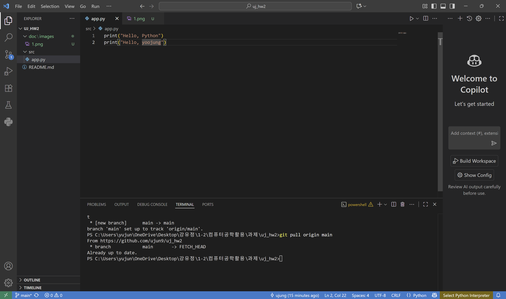

# Python GitHub 과제

## 1. 과제 개요
- VS Code에서 Python 프로젝트를 생성하고 Git/GitHub을 활용하여 버전 관리 및 저장소 연동을 실습한다.  
- commit 메시지 규칙:  
  - 첫 번째: `ADD: ...`  
  - 이후 기능 추가: `MODIFY: ...`  
  - 코드 수정: `FIX: ...`  

## 2. 프로젝트 폴더 구조
```
project_root/
 ├─ src/
 │   └─ app.py
 ├─ doc/
 │   └─ images/
 │       ├─ capture1.png
 │       └─ capture2.png
 └─ README.md
```

## 3. 수행 과정
1. src/app.py 작성 및 첫 commit
- commit 메세지: ADD: app.py First
- 수행 내용: print("Hello, Python")

2. 코드 수정 및 추가 commit
- 두 번째 commit: MODIFY: app.py name
- 세 번째 commit: FIX: name change from UJ to yoojung

3. 화면 캡쳐
- capture1.png: 2번 항목까지 commit을 완료한 후의 VS Code 화면
- capture2.png: GitHub에 push하고, 다시 pull 한 후의 VS Code 화면




## 4. GitHub Repositore URL
- URL: https://github.com/ujun9/uj_hw2.git
